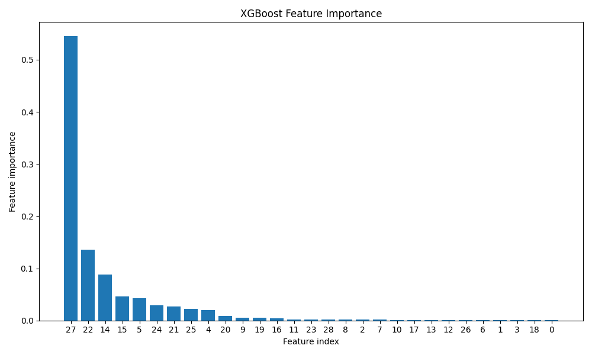
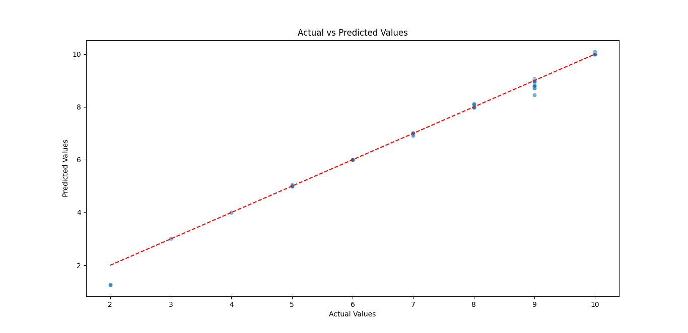
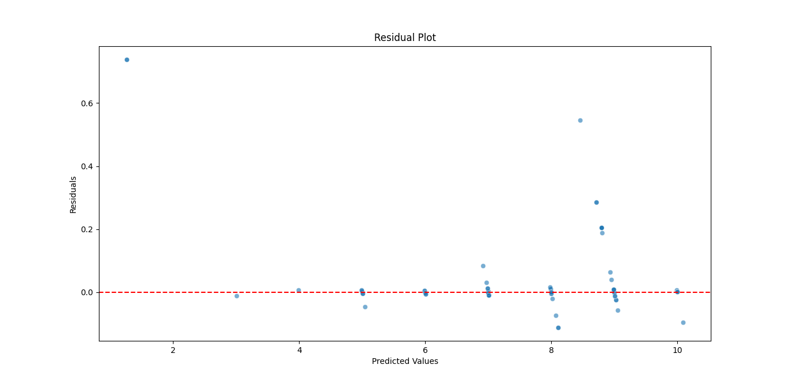
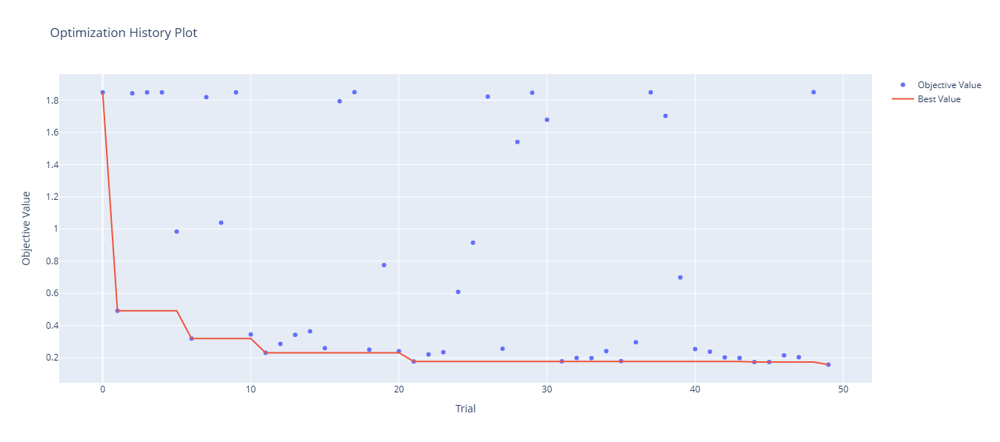
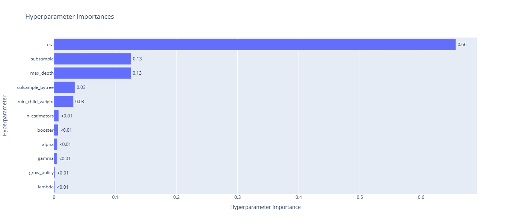

# Predicción de la Satisfacción de Usuarios de un Sitio Web mediante Machine Learning


## Regresión de aprendizaje automático de XGBoost optimizada con Optuna

El algoritmo XGBoost significa "Impulso de Gradiente Extremo". Se centra en la velocidad computacional y el rendimiento del modelo.
Optuna es un marco avanzado de optimización de hiperparámetros con visualizaciones para mayor interpretabilidad.

### Código Python:

### 1. Establecer el directorio de trabajo y cargar los datos
```
import os
os.chdir('C:/Users/Alejandro/Documents/')
import pandas as pd
data = pd.read_csv('website365.csv')
data.info()
```
### 2. Importar bibliotecas
```
import numpy as np
import pandas as pd
import xgboost as xgb
import optuna
from sklearn.datasets import make_regression
from sklearn.model_selection import train_test_split
import matplotlib.pyplot as plt
import seaborn as sns
```
### 3. Separar las variables target y features
```
X = data.drop('Satisfaction', axis=1)
y = data['Satisfaction']
```
### 4. Dividir los datos en conjuntos de entrenamiento y prueba
```
X_train, X_test, y_train, y_test = train_test_split(X, y, test_size=0.2, random_state=42)
```
### 5. Usar Optuna para optimizar los hiperparámetros del modelo XGBoost
Definir la función objetivo para Optuna.
```
from sklearn.metrics import root_mean_squared_error

def objective(trial):
    params = {
        'objective': 'reg:squarederror',
        'eval_metric': 'rmse',
        'booster': trial.suggest_categorical('booster', ['gbtree', 'gblinear', 'dart']),
        'lambda': trial.suggest_float('lambda', 1e-8, 1.0, log=True),
        'alpha': trial.suggest_float('alpha', 1e-8, 1.0, log=True),
        'max_depth': trial.suggest_int('max_depth', 1, 9),
        'eta': trial.suggest_float('eta', 1e-8, 1.0, log=True),
        'gamma': trial.suggest_float('gamma', 1e-8, 1.0, log=True),
        'grow_policy': trial.suggest_categorical('grow_policy', ['depthwise', 'lossguide']),
        'n_estimators': trial.suggest_int('n_estimators', 50, 500),
        'subsample': trial.suggest_float('subsample', 0.1, 1.0),
        'colsample_bytree': trial.suggest_float('colsample_bytree', 0.1, 1.0),
        'min_child_weight': trial.suggest_int('min_child_weight', 1, 10),
    }
    
    model = xgb.XGBRegressor(**params, random_state=42)
    model.fit(X_train, y_train, eval_set=[(X_test, y_test)], verbose=False)
    preds = model.predict(X_test)
    rmse = root_mean_squared_error(y_test, preds)
    return rmse
```
### 6. Llevar a cabo la optimización Optuna
```
study = optuna.create_study(direction='minimize')
study.optimize(objective, n_trials=50, show_progress_bar=True)
```
### 7. Entrenar el modelo final con los mejores hiperparámetros
```
best_params = study.best_params
best_params['objective'] = 'reg:squarederror'
best_params['random_state'] = 42

final_model = xgb.XGBRegressor(**best_params)
final_model.fit(X_train, y_train, eval_set=[(X_test, y_test)], verbose=True)
```
### 8. Evaluar el modelo
```
y_pred = final_model.predict(X_test)

print("\nEvaluation Metrics:")
```
### Calcular las métricas de la evaluación
```
from sklearn.metrics import mean_absolute_percentage_error, mean_squared_error, r2_score, explained_variance_score, mean_absolute_error

mape = mean_absolute_percentage_error(y_test, y_pred)
mse = mean_squared_error(y_test, y_pred)
rmse = root_mean_squared_error(y_test, y_pred)
mae = mean_absolute_error(y_test, y_pred)
r2 = r2_score(y_test, y_pred)
explained_var = explained_variance_score(y_test, y_pred)
```
### Desplegar las métricas de evaluación
```
print(f"MAPE, mean absolute percentage error:", round(mape,5))
print(f"MSE, Mean squared error:", round(mse,5))
print(f"RMSE, Root mean squared error:", round(rmse,5))
print(f"MAE, Mean absolute error:", round(mae,5))
print(f"R2, R-squared:", round(r2,5))
print(f"Explained variance:", round(explained_var,5))
```
## RESULTADO

Evaluation Metrics:

MAPE, mean absolute percentage error: 0.01529

MSE, Mean squared error: 0.02494

RMSE, Root mean squared error: 0.15792

MAE, Mean absolute error: 0.06406

R2, R-squared: 0.99271

Explained variance: 0.99331

### 9. Gráficos

### Gráfico de importancia de las variables predictivas
```
feature_importance = final_model.feature_importances_
sorted_idx = np.argsort(feature_importance)[::-1]

plt.figure(figsize=(10, 6))
plt.bar(range(X.shape[1]), feature_importance[sorted_idx], align='center')
plt.xticks(range(X.shape[1]), sorted_idx)
plt.xlabel('Feature index')
plt.ylabel('Feature importance')
plt.title('XGBoost Feature Importance')
plt.tight_layout()
plt.show()
```


### Graficar valores reales y predichos
```
plt.figure(figsize=(8, 8))
sns.scatterplot(x=y_test, y=y_pred, alpha=0.6)
plt.plot([min(y_test), max(y_test)], [min(y_test), max(y_test)], '--r')
plt.xlabel('Actual Values')
plt.ylabel('Predicted Values')
plt.title('Actual vs Predicted Values')
plt.show()
```


### Grafico de los residuos
```
residuals = y_test - y_pred
plt.figure(figsize=(8, 6))
sns.scatterplot(x=y_pred, y=residuals, alpha=0.6)
plt.axhline(y=0, color='r', linestyle='--')
plt.xlabel('Predicted Values')
plt.ylabel('Residuals')
plt.title('Residual Plot')
plt.show()
```


### Graficar el historial de optimización
```
optuna.visualization.plot_optimization_history(study).show()
```


### Graficar la importancia de los parámetros
```
optuna.visualization.plot_param_importances(study).show()
```


